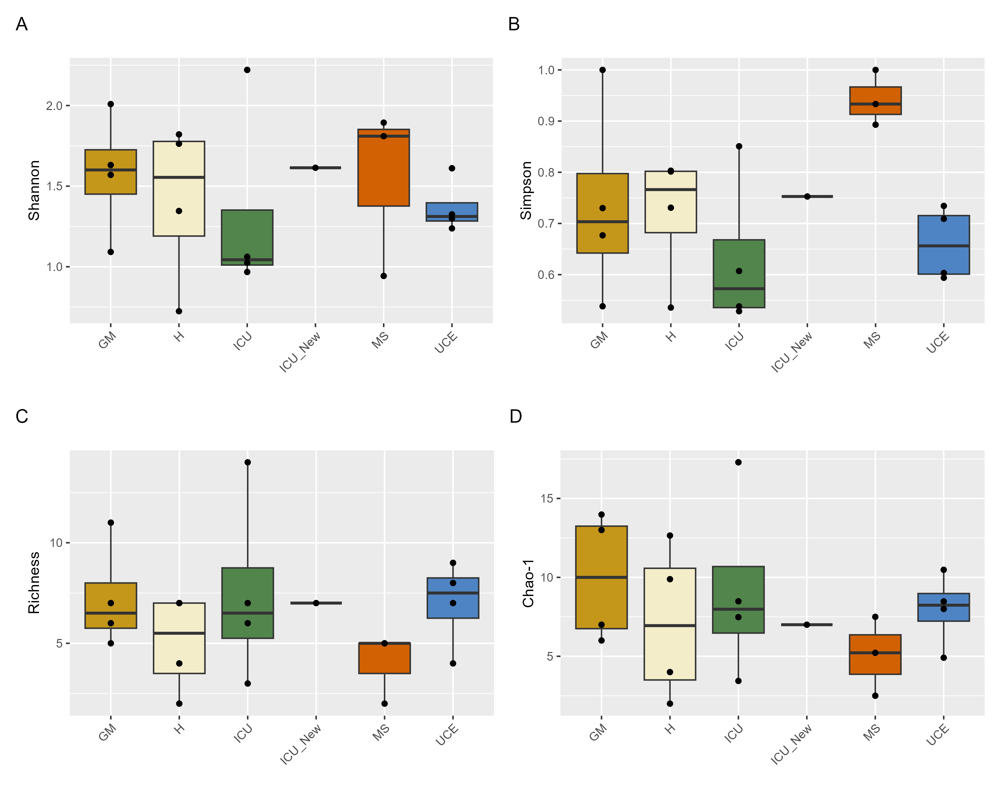
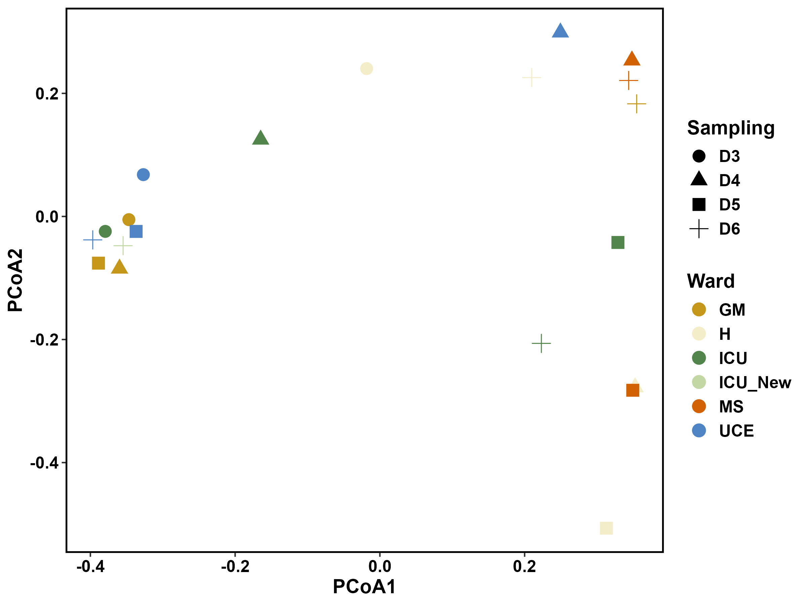
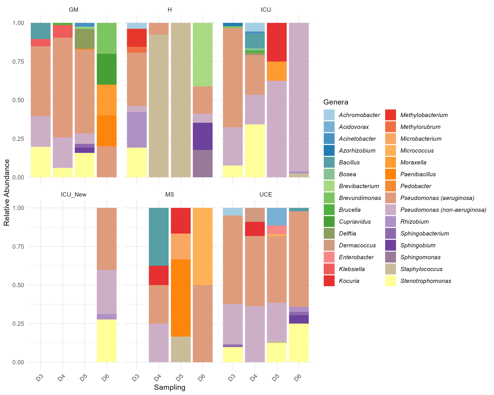
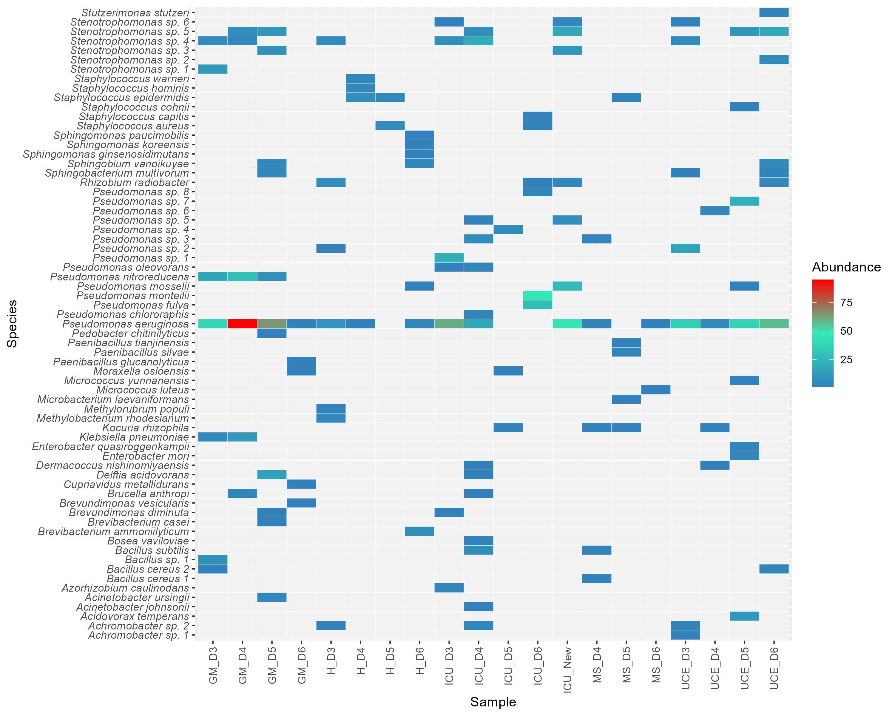
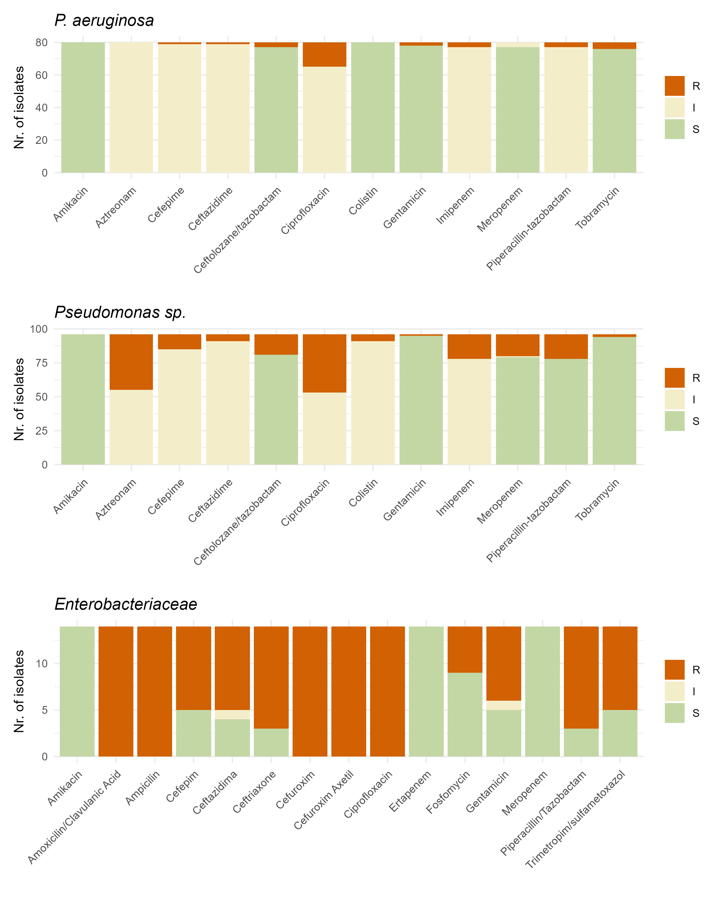

# **Yearlong Analysis of Bacterial Diversity in Hospital Sink Drains: Culturomics, Antibiotic resistance and Implications for Infection Control**

This repository contains R scripts used in the article: [Yearlong Analysis of Bacterial Diversity in Hospital Sink Drains: Culturomics, Antibiotic resistance and Implications for Infection Control](https://www.frontiersin.org/articles/10.3389/fmicb.2024.1501170), doi: 10.3389/fmicb.2024.1501170.

---

## Table of Contents
- [Description](#description)
- [Requirements](#requirements)
- [Scripts Overview](#scripts-overview)
  - [AlfaDiversity](#alfadiversity)
  - [BetaDiversity](#betadiversity)
  - [GenusRelativeAbundance](#genusrelativeabundance)
  - [Heatmap](#heatmap)
  - [ASTResult](#astresult)
- [How to Run the Scripts](#how-to-run-the-scripts)
- [Customizing the Scripts](#customizing-the-scripts)
  - [Modifying the Dataset](#modifying-the-dataset)
  - [Modifying the File Paths](#modifying-the-file-paths)
  - [Adjusting the Analysis](#adjusting-the-analysis)
  - [Data Structure Requirements](#data-structure-requirements)
  - [Testing](#testing)
- [Contact](#contact)

---

## **Description**

This repository contains scripts to analyze microbial diversity indices (alpha and beta diversity), genera relative abundance, and antibiotic resistance test results. The analyses include visualizations such as boxplots, PCoA plots, heatmaps, and bar charts, along with statistical tests (ANOVA and PERMANOVA) to assess microbial diversity and antibiotic resistance patterns.

---

## **Requirements**

To run the scripts, you need the following:

- **R version 4.0+**
- The following R packages:
  - `ggplot2`
  - `readxl`
  - `tidyverse`
  - `vegan`
  - `patchwork`
  - `RColorBrewer`

You can install the required packages by running:

```r
install.packages(c("ggplot2", "readxl", "tidyverse", "vegan", "patchwork", "RColorBrewer"))
```

---

## **Scripts Overview**

### AlfaDiversity
**Description**: This script generates boxplots for different alpha diversity indices (Shannon, Simpson, Richness, and Chao-1) across different Wards. It also performs ANOVA to assess statistical differences between Wards and Sampling points.

- **Outputs**:
  - Combined boxplots for alpha diversity indices: `alpha_diversity_plots.png`, `.tiff`, `.svg`
  - ANOVA results for Shannon diversity printed to the console.

<p align="center">
  
</p>

---

### BetaDiversity
**Description**: This script calculates the Bray-Curtis dissimilarity matrix, performs Principal Coordinates Analysis (PCoA), and visualizes beta diversity across Wards and Sampling points. It also runs PERMANOVA to assess the significance of group differences.

- **Outputs**:
  - PCoA plot for beta diversity: `pcoa_plot.png`, `.tiff`, `.svg`
  - PERMANOVA results printed to the console.

<p align="center">
  
</p>

---

### GenusRelativeAbundance
**Description**: This script plots the relative abundance of genera across different Sampling points and Wards. The genera are displayed as stacked bar plots, and the relative abundance is calculated for each group.

- **Outputs**:
  - Genera relative abundance plot: `genera_relative_abundance.png`, `.tiff`, `.svg`

<p align="center">
  
</p>

---

### Heatmap
**Description**: This script generates a heatmap representing species abundance across different samples. A gradient color scale is used to represent the abundance levels, and missing or zero values are shown in grey.

- **Outputs**:
  - Heatmap of species abundance: `species_abundance_heatmap.png`, `.tiff`, `.svg`

<p align="center">
  
</p>

---

### ASTResult
**Description**: This script visualizes antibiotic resistance test (AST) results, displaying stacked bar plots for each species. The plots show the number of isolates classified as susceptible (S), intermediate (I), or resistant (R) to each antibiotic.

- **Outputs**:
  - Combined bar plots of AST results: `antibiotic_resistance_plots.png`, `.tiff`, `.svg`

<p align="center">
  
</p>

---

## **How to Run the Scripts**

1. Clone the repository to your local machine:

    ```bash
    git clone https://github.com/zelaco/DrainsDiversityArticle.git
    ```

2. Open the R project in RStudio.

3. Ensure all the required R packages are installed.

4. To run each script, simply source it in RStudio:

    ```r
    source("AlfaDiversity.R")
    source("BetaDiversity.R")
    source("GenusRelativeAbundance.R")
    source("Heatmap.R")
    source("ASTResult.R")
    ```

**Alternatively, open the script in RStudio, ensure all R packages are correctly installed, and run the script!**

---

## **Customizing the Scripts**

If you want to run the scripts with your own data, or modify them to suit your analysis, follow the instructions below:

### Modifying the Dataset
Each script relies on specific datasets provided in Excel format. You can replace the default datasets with your own, but the structure of your data should be similar to the example datasets provided.

- **AlfaDiversity.R**: Requires a dataset structured with columns for Wards and various alpha diversity indices (e.g., `Shannon_H`, `Simpson`, `Taxa_S`, `Chao1`).
- **BetaDiversity.R**: Requires a species-by-sample matrix where rows are species and columns are samples, with Bray-Curtis dissimilarities calculated from this matrix.
- **GenusRelativeAbundance.R**: Requires a dataset where columns represent genera and rows represent different samples, with associated metadata columns like `Ward` and `Sampling`.
- **Heatmap.R**: Requires a species abundance dataset with columns for samples and rows for species.
- **ASTResult.R**: Requires a dataset structured with columns for species, antibiotics, and resistance results (`S`, `I`, `R`).

### Modifying the File Paths

By default, the scripts read from specific file paths (e.g., `"Data/DiversityIndexes.xlsx"`). If you are using different datasets, update the file paths in the scripts:

For example, in `AlfaDiversity.R`, change:

```r
divInd <- read_excel("Data/DiversityIndexes.xlsx")
```

to the path of your own dataset:

```r
divInd <- read_excel("your/custom/path/YourData.xlsx")
```

### Adjusting the Analysis

- **ANOVA and PERMANOVA**: If your dataset has different groupings (e.g., different Wards or Sampling points), make sure the grouping variables in the scripts match your dataset's column names.

- **Plots and Visualizations**: The `ggplot2` visualizations in each script can be customized by changing the aesthetics (e.g., colors, labels, etc.). For example, you can adjust the color palette by modifying the `scale_fill_manual()` function in `ggplot2`.

---

### Data Structure Requirements

Ensure that your dataset follows these guidelines:

- **Excel Format**: The scripts use `readxl` to import data, so the data should be in Excel format (`.xlsx`). If using other formats (e.g., CSV), you can modify the `read_excel()` function to `read_csv()` or other relevant data import functions.

- **Column Names**: The scripts rely on specific column names (e.g., `Shannon_H`, `Simpson`, `Species`, `Antibiotic`, etc.). Ensure that your custom dataset has columns with the same names or modify the script to match your column names.

### Testing

It is recommended to first test the script with the provided sample datasets to ensure the script works as expected. Then, replace the datasets with your own, making sure the data format remains consistent.

---

## **Contact**

If you have any questions or need further information, feel free to reach out:

- Email: [j.serpa@uib.es]
- GitHub: [github.com/zelaco]

